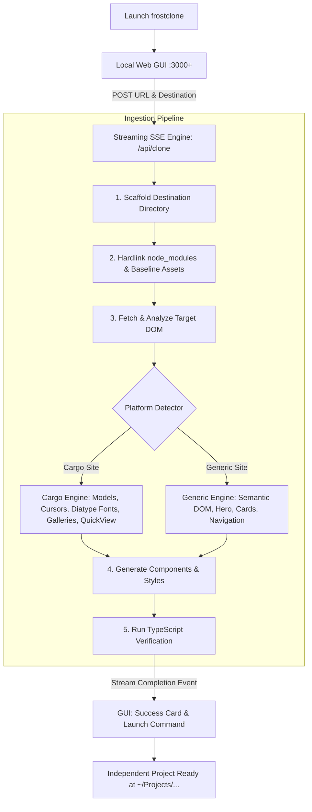

# ❄️ Frostclone

<div align="center">

[](LICENSE)
[](https://nextjs.org/)
[](https://react.dev/)
[](https://tailwindcss.com/)
[](https://www.typescriptlang.org/)

**Autonomous Website Re-engineering & Ingestion Engine with Standalone Web GUI**

*Input any URL → Specify your local destination → Generate a standalone, runnable Next.js 16 codebase in seconds.*

---


</div>

---

## 🌟 Highlights

- **⚡ Standalone Web GUI:** Run `frostclone` or `npm run app` to launch a clean, modern dashboard in your browser.
- **🎯 Dynamic Port Resolution:** Automatically detects port availability (e.g., if port `3000` is busy, safely increments to `3001`, `3002`, etc.) and opens your browser directly.
- **📂 Isolated Project Scaffolding:** Clones websites directly into a target folder of your choice (e.g., `~/Projects/mysite`) without modifying the template.
- **🔗 Instant Hardlinked Dependencies:** Uses filesystem hardlinks (`cp -al`) for `node_modules`. Zero disk space duplication (~400MB saved per clone) and instant scaffolding (<0.5s setup time) while remaining 100% compatible with Next.js Turbopack.
- **🧩 Specialized Ingestion Engines:**
  - **Cargo Collective Engine:** Detects and parses Cargo data models, image galleries (1, 2, and 3 column grids), custom cursors, custom web fonts (`Diatype Variable`), slide-in menus, and lightbox modals.
  - **Generic Site Engine:** Extracts semantic document hierarchy, hero sections, responsive feature grids, navigation bars, images, and footers.
- **📡 Real-Time SSE Streaming Logs:** Live terminal feedback in the GUI showing stage progress, asset download logs, and compilation checkpoints.
- **🛡️ Automated Verification:** Automatically verifies generated projects with `tsc --noEmit` before concluding.

---

## 🚀 Quick Start

### 1. Run the GUI Application

From anywhere in your terminal:
```bash
frostclone
```
*(Or inside this repository: `npm run app`)*

### 2. Enter URL & Destination

1. Enter the **Target Website URL** (e.g., `https://1987.graphics` or `https://example.com`).
2. The **Local Clone Destination** auto-slugs (e.g., `~/Projects/1987`), or you can type a custom path.
3. Click **Start Ingestion**.

### 3. Run Your New Clone

Once complete, your new site is an independent, complete Next.js project:
```bash
cd ~/Projects/1987
npm run dev
```

---

## 🏗️ Architecture & Pipeline



---

## 📁 Repository Structure

```
frostclone/
├── bin/
│   └── frostclone.mjs        # CLI launcher with dynamic port finder & browser opener
├── src/
│   ├── app/
│   │   ├── api/
│   │   │   └── clone/
│   │   │       └── route.ts  # Streaming Server-Sent Events (SSE) route handler
│   │   ├── globals.css       # Tailwind CSS v4 styling & design tokens
│   │   ├── layout.tsx        # Root application layout
│   │   └── page.tsx          # Standalone Web GUI Dashboard
│   ├── components/
│   │   └── ui/               # shadcn/ui primitives
│   ├── lib/
│   │   ├── cloner/
│   │   │   ├── cargo.ts      # Specialized Cargo Collective extraction engine
│   │   │   ├── engine.ts     # Master orchestration engine
│   │   │   ├── generic.ts    # Generic website extraction engine
│   │   │   └── types.ts      # TypeScript definitions for clone events
│   │   └── utils.ts          # Utility helpers (cn)
│   └── types/                # Core TypeScript schemas
├── docs/
│   ├── ARCHITECTURE.md       # Technical design and engine internals
│   └── design-references/    # UI screenshots and visual references
├── scripts/                  # Development scripts
├── package.json
└── tsconfig.json
```

---

## 💻 CLI Commands

| Command | Description |
|---|---|
| `npm run app` / `frostclone` | Start the local Web GUI and open it in your default browser |
| `npm run dev` | Start Next.js development server |
| `npm run build` | Compile optimized production build with Turbopack |
| `npm run start` | Serve production build locally |
| `npm run typecheck` | Run strict TypeScript compiler verification (`tsc --noEmit`) |
| `npm run lint` | Run ESLint across the codebase |
| `npm run check` | Run `lint` + `typecheck` + `build` in sequence |

---

## 🛠️ Tech Stack

- **Framework:** Next.js 16 (App Router, Turbopack)
- **Runtime:** Node.js 24+ / React 19
- **Styling:** Tailwind CSS v4 with OKLCH tokens
- **Communication:** Server-Sent Events (SSE) via Web Streams API
- **Tooling:** TypeScript 5 (Strict Mode), ESLint 9

---

## ⚖️ Ethical Use & Disclaimer

Frostclone is engineered for developer productivity, site migrations, and reverse-engineering research:

- **Platform Migration:** Move sites you own from proprietary website builders into clean Next.js codebases.
- **Source Recovery:** Recover modern source code for sites whose original repository or developer was lost.
- **Design Study:** Analyze how production web designs structure CSS layouts, fonts, and responsive behavior.

**Not Intended For:**
- Phishing, credential harvesting, or deceptive impersonation.
- Infringing upon trademarks, copyrights, or proprietary brand assets.
- Violating website terms of service where prohibited.

---

## 📄 License

[MIT](LICENSE) © 2026 Frostclone Authors.
