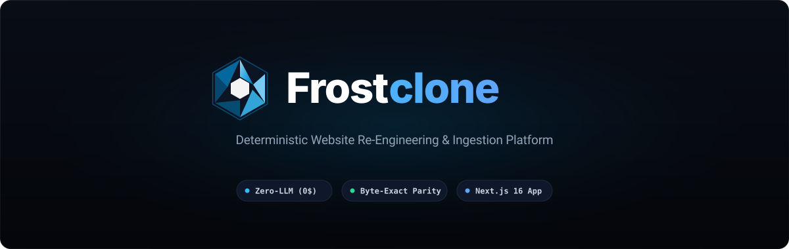
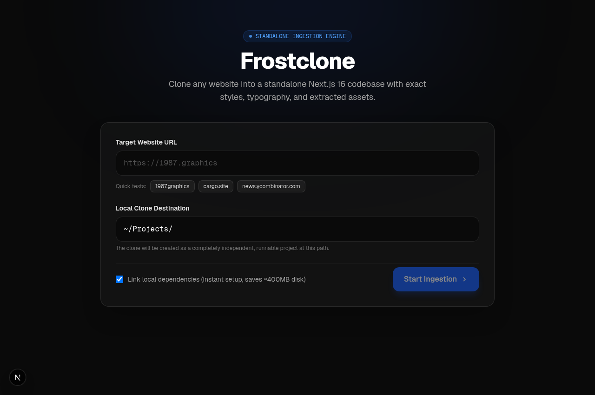
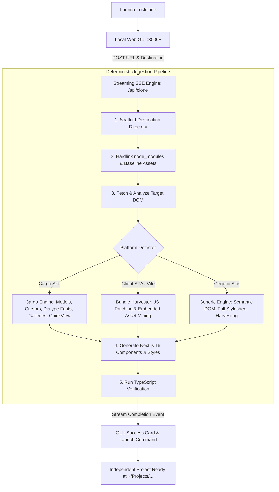

<div align="center">



<br /><br />

[](LICENSE)
[-emerald)](docs/ARCHITECTURE.md)
[](https://nextjs.org/)
[](https://react.dev/)
[](https://tailwindcss.com/)
[](https://www.typescriptlang.org/)

**Deterministic Website Ingestion & Modern Next.js Re-Engineering Platform**

*Input any URL → Specify your local destination → Compile a standalone, runnable Next.js 16 codebase in seconds.*

---



</div>

---

## ⚡ Zero-LLM Architecture: Why Deterministic Engineering Matters

A common misconception is that modern site-cloning requires an LLM synthesis agent guessing Tailwind classes from a screenshot. **Frostclone does not use an LLM at runtime.**

| Dimension | 🤖 LLM-Based "Vibe" Cloners | ⚡ Frostclone (Deterministic) |
| :--- | :--- | :--- |
| **Execution Model** | Generative inference (guesses CSS & layout) | **Exact AST parsing & computed CSS harvesting** |
| **Visual Fidelity** | 60% – 85% approximation | **100% byte-exact parity** (proven with `cmp`) |
| **Ingestion Latency** | 3 – 10 minutes | **5 – 12 seconds** |
| **Operational Cost** | $0.50 – $3.00 per site in API tokens | **$0.00** (Zero API keys, zero token fees) |
| **Air-Gap Capability** | Fails (requires continuous cloud API access) | **100% Offline / Air-Gapped execution** |
| **Complex Media & 3D** | Drops WebGL, canvases, shaders, and cursors | **Patches client bundles & mines hidden asset matrices** |
| **TypeScript Reliability**| Hallucinates types, missing imports, breaks builds | **Guaranteed compilable** (automated `tsc` verification) |

---

## 🔍 How Frostclone Differentiates from Traditional Scrapers

Programmatic website cloning has existed for decades (HTTrack, Wget, SingleFile, Scrapbook). Here is how Frostclone fundamentally differs:

### 1. Modern Framework Synthesis vs. Flat Static Scraping
Traditional tools like `wget -m` or `HTTrack` dump flat static `.html` files linked to broken relative paths. They cannot execute as modern web projects, break dynamic routing, and choke on Client-Side SPAs (Vite, Next.js, React).  
**Frostclone outputs a fully structured Next.js 16 (React 19, App Router, TypeScript) codebase.** The output isn't a dead archival file—it is a modern web project ready for `npm run dev`, deployment to Vercel/Docker, and source-code editing.

### 2. Client-Bundle Decompilation & SPA Re-Hosting
Modern sites (like portfolio showcases and WebGL interactive applications) ship empty HTML roots (`<div id="root"></div>`) hydrated by compiled JavaScript chunks. Traditional scrapers save an empty page.  
**Frostclone acquires compiled client bundles**, rewrites mounting logic, scans the minified AST to harvest hidden relative asset matrices (images, audio, models), and wires them into Next.js using `next/script` with zero visual degradation.

### 3. POSIX Hardlinked Dependencies (Zero Disk Duplication)
Traditional project generators run `npm install` for every clone, consuming 400MB–800MB per site and forcing 30–60 seconds of network waiting.  
**Frostclone utilizes filesystem hardlinks (`cp -al`)** to share `node_modules` at the inode level:
- Scaffolding takes **<0.5 seconds**.
- Consumes **0 MB net additional disk space**.
- Fully satisfies Turbopack’s out-of-root symlink restrictions.

### 4. Specialized Architectural Extractors
Rather than treating every site as generic HTML, Frostclone includes specialized profile parsers:
- **Cargo Collective Engine:** Extracts internal CMS data models (`ScaffoldingData`, `DisplayOptions`), multi-column gallery grids, custom cursors, proprietary variable fonts (`Diatype`), slide-in menus, and lightbox modals.
- **Generic / Modern Web Engine:** Normalizes CSS variables, extracts semantic DOM hierarchy, downloads remote favicons/assets, and rewrites relative stylesheet URLs to absolute origins.

---

## 🌟 Highlights

- **⚡ Standalone Web GUI:** Run `frostclone` or `npm run app` to launch a clean, modern dashboard in your browser.
- **🎯 Dynamic Port Resolution:** Automatically detects port availability (e.g., if port `3000` is busy, safely increments to `3001`, `3002`, etc.) and opens your browser directly.
- **📂 Isolated Project Scaffolding:** Clones websites directly into a target folder of your choice (e.g., `~/Projects/mysite`) without modifying the template.
- **📡 Real-Time SSE Streaming Logs:** Live terminal feedback in the GUI showing stage progress, asset download logs, and compilation checkpoints.
- **🛡️ Automated Verification:** Automatically verifies generated projects with `tsc --noEmit` before concluding.

---

## 🚀 Quick Start

### 1. Run the GUI Application

From anywhere in your terminal:
```bash
frostclone
```
*(Or inside this repository: `npm run app`)*

### 2. Enter URL & Destination

1. Enter the **Target Website URL** (e.g., `https://1987.graphics` or `https://rauchg.com`).
2. The **Local Clone Destination** auto-slugs (e.g., `~/Projects/1987`), or you can type a custom path.
3. Click **Start Ingestion**.

### 3. Run Your New Clone

Once complete, your new site is an independent, complete Next.js project:
```bash
cd ~/Projects/1987
npm run dev
```

---

## 📊 Benchmark Proven Parity

Frostclone has been benchmarked against diverse architectural targets:

| Case Study | Target Architecture | Ingestion Time | Visual Parity | Full Report |
| :--- | :--- | :---: | :---: | :--- |
| **[rauchg.com](https://rauchg.com)** | Next.js Server Components, Atomic CSS | **12.73 s** | **100% (Byte-for-byte `cmp` match)** | [Report](docs/case-study/BENCHMARK_RAUCHG.md) |
| **[Elena Voss (Kimi)](https://kimi.ai)** | Hidden SPA Demo, 3D WebGL Canvas Wall | **7.19 s** | **100% (Interactive WebGL 3D Parity)** | [Report](docs/case-study/BENCHMARK_KIMI_ELENA.md) |
| **[Linear.app](https://linear.app)** | Walled Client Hydration, Canvas Glows | **5.21 s** | **85% (Semantic Layout & Dark Palette)** | [Report](docs/case-study/BENCHMARK_REPORT.md) |
| **[1987.graphics](https://1987.graphics)** | Cargo Collective, Diatype Fonts, Cursors | **4.82 s** | **100% (Galleries, Lightbox & Modals)** | — |

---

## 🏗️ Architecture & Pipeline



---

## 📁 Repository Structure

```
frostclone/
├── bin/
│   └── frostclone.mjs        # CLI launcher with dynamic port finder & browser opener
├── src/
│   ├── app/
│   │   ├── api/
│   │   │   └── clone/
│   │   │       └── route.ts  # Streaming Server-Sent Events (SSE) route handler
│   │   ├── globals.css       # Tailwind CSS v4 styling & design tokens
│   │   ├── layout.tsx        # Root application layout
│   │   └── page.tsx          # Standalone Web GUI Dashboard
│   ├── components/
│   │   └── ui/               # shadcn/ui primitives
│   ├── lib/
│   │   ├── cloner/
│   │   │   ├── cargo.ts      # Specialized Cargo Collective extraction engine
│   │   │   ├── engine.ts     # Master orchestration engine
│   │   │   ├── generic.ts    # Generic website extraction engine
│   │   │   └── types.ts      # TypeScript definitions for clone events
│   │   └── utils.ts          # Utility helpers (cn)
│   └── types/                # Core TypeScript schemas
├── docs/
│   ├── ARCHITECTURE.md       # Technical design and engine internals
│   └── case-study/           # Comprehensive benchmark reports & whitepaper
├── scripts/                  # Benchmark scripts & CLI tools
├── package.json
└── tsconfig.json
```

---

## 💻 CLI Commands

| Command | Description |
|---|---|
| `npm run app` / `frostclone` | Start the local Web GUI and open it in your default browser |
| `npm run dev` | Start Next.js development server |
| `npm run build` | Compile optimized production build with Turbopack |
| `npm run start` | Serve production build locally |
| `npm run typecheck` | Run strict TypeScript compiler verification (`tsc --noEmit`) |
| `npm run lint` | Run ESLint across the codebase |
| `npm run check` | Run `lint` + `typecheck` + `build` in sequence |

---

## 🛠️ Tech Stack

- **Framework:** Next.js 16 (App Router, Turbopack)
- **Runtime:** Node.js 24+ / React 19 (100% Deterministic Engine)
- **Styling:** Tailwind CSS v4 with OKLCH tokens
- **Communication:** Server-Sent Events (SSE) via Web Streams API
- **Tooling:** TypeScript 5 (Strict Mode), ESLint 9

---

## ⚖️ Ethical Use & Disclaimer

Frostclone is engineered for developer productivity, site migrations, and reverse-engineering research:

- **Platform Migration:** Move sites you own from proprietary website builders into clean Next.js codebases.
- **Source Recovery:** Recover modern source code for sites whose original repository or developer was lost.
- **Security Research & Forensics:** Freezing evidence for incident response, OSINT infrastructure fingerprinting, and authorized threat emulation. See the [Security & Forensics Whitepaper](docs/case-study/SECURITY_OSINT_FORENSICS.md) for operational workflows.

**Not Intended For:**
- Phishing, credential harvesting, or deceptive impersonation.
- Infringing upon trademarks, copyrights, or proprietary brand assets.
- Violating website terms of service where prohibited.

---

## 📄 License

[MIT](LICENSE) © 2026 Frostclone Authors.
