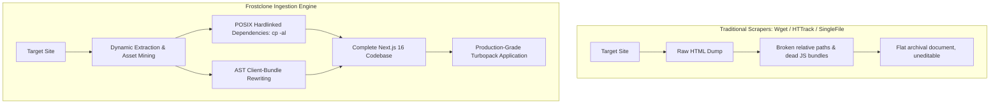

# Frostclone Architecture & Engine Specification

This document details the internal architecture, deterministic runtime guarantees, streaming protocol, and differentiation of the Frostclone ingestion platform.

---

## 1. Deterministic Runtime Guarantee (Zero-LLM Pipeline)

Frostclone is **not an AI synthesis wrapper**. It runs on a **100% deterministic, programmatic pipeline**:

- **No LLM Tokens:** Ingestion, AST parsing, and code generation do not invoke OpenAI, Anthropic, or local model weights.
- **Reproducibility:** Two runs against the same static target yield identical outputs.
- **Zero API Keys & Cost:** Requires no external service accounts, internet-facing AI gateways, or credit card authorizations.
- **Air-Gapped & Confidential:** Safe to execute within restricted corporate or government networks without leaking target URLs or DOM structure to third-party LLM providers.

---

## 2. Technical Differentiation: Frostclone vs. Legacy Programmatic Tools



### Key Architectural Differences

| Capability | Legacy Scrapers (`wget`, `HTTrack`) | SingleFile / MHTML | Frostclone |
| :--- | :--- | :--- | :--- |
| **Output Format** | Flat directory of `.html` / `.js` | Monolithic base64 HTML blob | **Complete Next.js 16 Project** |
| **Modern Framework Stack** | None (static files) | None | **React 19, TypeScript, Tailwind v4** |
| **Client-Side SPA / Vite** | Fails (saves `<div id="root"></div>`) | Incomplete DOM freeze | **Patches bundles & mines asset matrix** |
| **Editable Components** | Unmaintainable minified chunks | Monolithic uneditable file | **Modular page, layout & globals.css** |
| **Disk Efficiency** | Redundant or requires `npm install` | High per-file footprint | **Hardlinked node_modules (0 MB duplicate)** |
| **Verification Gate** | None (runtime failures common) | None | **Automated `tsc --noEmit` validation** |

---

## 3. Ingestion Lifecycle

```
[User Request: URL + Destination]
           │
           ▼
[1. Initialization & Path Normalization]
     - Resolves `~` to `os.homedir()`
     - Normalizes protocol (`https://`)
           │
           ▼
[2. Filesystem Scaffolding]
     - Copies base config files (`package.json`, `tsconfig.json`, etc.)
     - Creates `src/app`, `src/components`, `src/lib`, `public/images`, etc.
     - Hardlinks `node_modules` via `cp -al` (Turbopack compatible, ~0.2s)
           │
           ▼
[3. Target Acquisition]
     - HTTP GET request with modern browser user-agent
     - Full document text buffer inspection
           │
           ▼
[4. Platform Detection]
     ├── Cargo Collective: `cargo.site` / `data-set="ScaffoldingData"`
     │     └── Executes `processCargoSite()`
     ├── Client-Side SPA: Vite / React bundle signatures
     │     └── Executes bundle extraction & relative asset mining
     └── Generic HTML: Semantic DOM & full CSS harvesting
           └── Executes `processGenericSite()`
           │
           ▼
[5. Asset Acquisition & Codegen]
     - Downloads fonts, icons, cursors, images
     - Rewrites relative CSS `url(...)` declarations to absolute origins
     - Writes typed Next.js components (`page.tsx`, `layout.tsx`, `globals.css`)
           │
           ▼
[6. Integrity Verification]
     - Runs `npx tsc --noEmit` inside the new destination directory
           │
           ▼
[7. Completion Event Emitted]
     - Streams final statistics (Title, Assets count, Component count)
```

---

## 4. Streaming Event Protocol

All progress events emitted by `/api/clone` adhere to the `CloneProgressEvent` interface:

```typescript
export interface CloneProgressEvent {
  stage: "init" | "scaffold" | "extract" | "assets" | "codegen" | "verify" | "done" | "error";
  percent: number;
  log?: {
    level: "info" | "success" | "warn" | "error" | "step";
    message: string;
    timestamp: number;
  };
  result?: {
    destPath: string;
    siteTitle: string;
    assetsCount: number;
    componentsCount: number;
  };
  error?: string;
}
```

---

## 5. Turbopack & Hardlinking Design

Next.js Turbopack strictly enforces that `node_modules` must not resolve to symlinks pointing outside the filesystem root of the application project. 

Frostclone solves this without duplicating ~400MB of dependencies per clone by using **filesystem hardlinks (`cp -al`)**. 

- On Linux/POSIX filesystems, hardlinked directory entries point to the same underlying inodes.
- Creation is instantaneous (<0.5s).
- Zero additional disk space is consumed for shared dependencies.
- Turbopack perceives `node_modules` as standard local directory entries within the project root.
