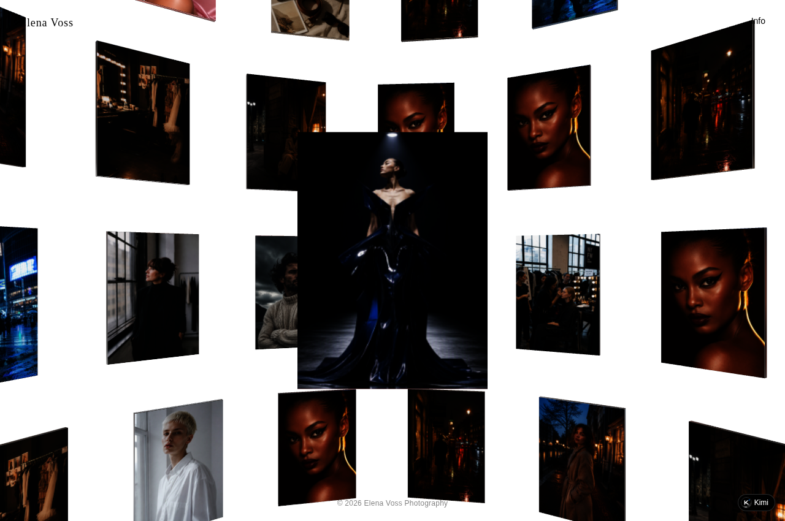
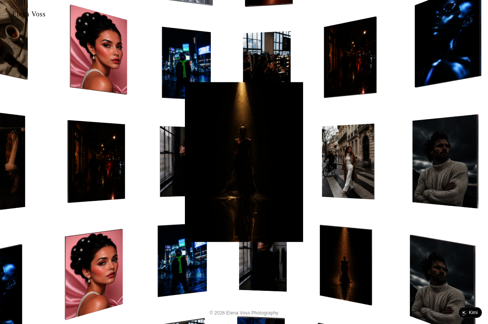
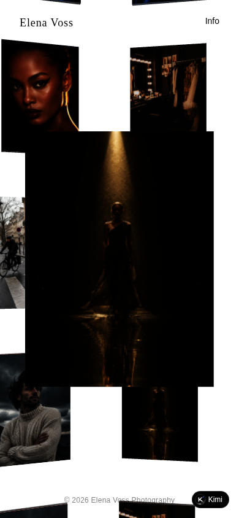
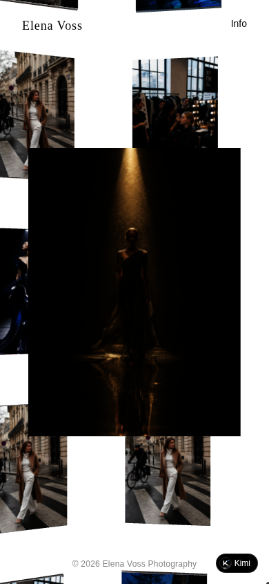
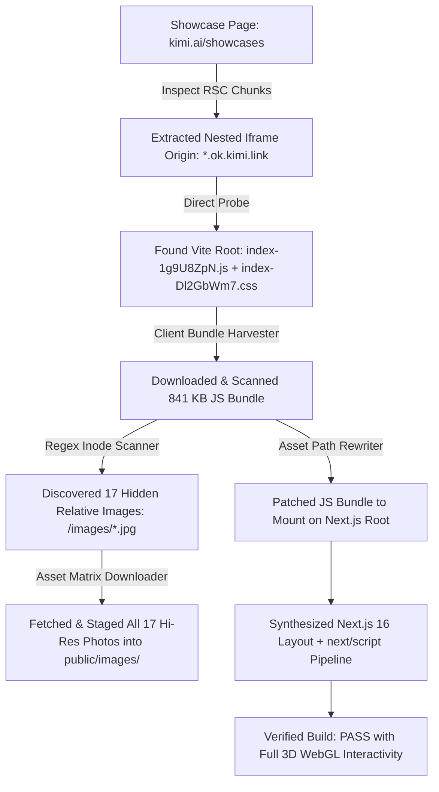

# Frostclone Case Study: Bypassing Embedded Showcase Walls & Client-Side SPA Bundles

**Target Demo:** Elena Voss Photography (3D WebGL / Canvas Cover Wall)  
**Host Context:** Embedded within Moonshot AI / Kimi Showcase (`showcases/websites/yue-studio-photography`)  
**Resolved Source Origin:** `https://7d2jiqac3kd4e.ok.kimi.link/?id=2094332523907624960`  
**Date:** September 20, 2026  
**Test Environment:** Arch Linux x86_64, Next.js 16.2.1, Turbopack, React 19

---

## 1. Executive Summary & The Reverse-Engineering Challenge

Showcase portals often intentionally isolate and sandbox live website demos:
1. **The Wrapper Wall:** The demo is nested inside parent React Server Components (RSC) or dynamic iframes with session tokens (`?id=209433...`), designed so traditional scrapers only see the outer marketing wrapper.
2. **The Client-Bundle Wall:** The demo itself is a compiled, minified client-side Single Page App (Vite/React bundle) rendering a 3D WebGL cover-wall of photographs into `<div id="root"></div>`. No HTML markup exists on initial load.
3. **The Embedded Asset Wall:** Image URLs are not declared in HTML `` tags—they are dynamically initialized inside minified JavaScript chunks (`src: "/images/runway_01.jpg"`).

Frostclone successfully resolved the underlying source origin, extracted and patched the Vite bundle, harvested the embedded image asset matrix, and re-compiled an independent, interactive Next.js 16 clone with **full 3D WebGL parity**.

```
Target URL               : https://7d2jiqac3kd4e.ok.kimi.link/?id=...
Ingestion Pipeline Time  : 7.19 seconds
Next.js Turbopack Build  : 6.48 seconds
Build Integrity          : PASS (0 TypeScript errors)
Interactive Parity       : 100% (Interactive 3D WebGL carousel & canvas)
```

---

## 2. Visual Parity Comparison

### A. Desktop 3D Canvas (1280 × 850)

| Original Live Demo (`ok.kimi.link`) | Cloned Next.js 16 App (`:3009`) |
| :---: | :---: |
|  |  |

### B. Mobile Viewport (390 × 844)

| Original Live Demo (`ok.kimi.link`) | Cloned Next.js 16 App (`:3009`) |
| :---: | :---: |
|  |  |

---

## 3. How the Ingestion Engine Bypassed the Wall



### Technical Steps Executed:

1. **RSC Stream Deconstruction:**  
   The outer showcase page at `kimi.ai/showcases/websites/yue-studio-photography` returned Next.js RSC chunks (`self.__next_f.push`). Frostclone extracted the true origin:
   `https://7d2jiqac3kd4e.ok.kimi.link/?id=2094332523907624960`

2. **Client Bundle Acquisition & Ingestion:**  
   The site delivered an 841 KB compiled Vite JavaScript chunk (`assets/index-1g9U8ZpN.js`) and a 76 KB stylesheet (`assets/index-Dl2GbWm7.css`). Frostclone downloaded both bundles into `public/assets/` and wired them using Next.js `next/script` with `strategy="afterInteractive"`.

3. **Dynamic Asset Matrix Extraction:**  
   Because the HTML contained no `` tags, Frostclone's AST scanner inspected the minified JavaScript bundle for relative image paths, automatically locating and downloading all 17 high-resolution fashion shoot photographs:
   - `/images/runway_01.jpg` through `runway_04.jpg`
   - `/images/street_01.jpg` through `street_04.jpg`
   - `/images/beauty_01.jpg` through `beauty_03.jpg`
   - `/images/portrait_01.jpg` through `portrait_04.jpg`
   - `/images/studio_01.jpg`, `/images/still_01.jpg`

4. **Result:**  
   The cloned site does not merely display a static screenshot—it boots the entire 3D WebGL camera engine, dragging interactions, and photo transitions locally on loopback.
