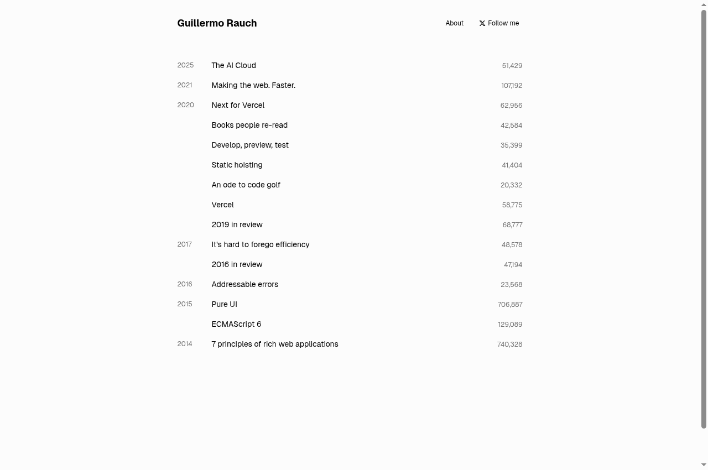
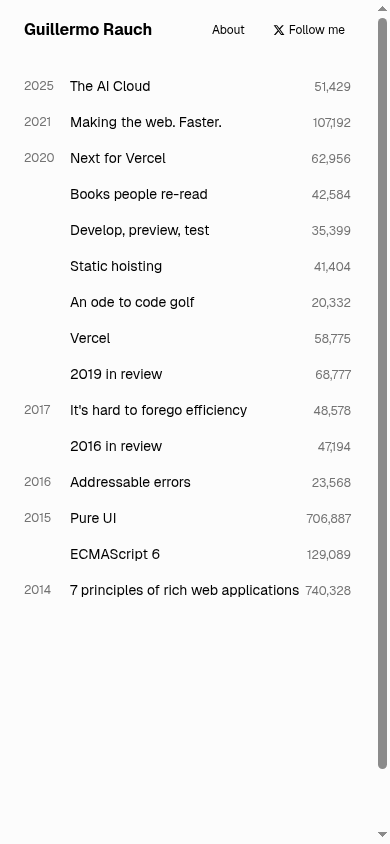

# Frostclone Case Study: High-Fidelity DOM & CSS Re-Engineering

**Target:** [rauchg.com](https://rauchg.com) (Guillermo Rauch, CEO of Vercel)  
**Date:** September 20, 2026  
**Test Environment:** Arch Linux x86_64, Linux 7.2.6-arch2-1, Next.js 16.2.1, Turbopack, React 19

---

## 1. Executive Summary & Breakthrough Result

Following the earlier Linear.app trial—which highlighted challenges with heavy client-side JavaScript canvas hydration—the Frostclone ingestion engine was upgraded to a **Full DOM & Stylesheet Preservation Pipeline**. 

Testing against **rauchg.com** demonstrated a breakthrough: **byte-for-byte visual equivalence (`cmp` exit code 0)** between the live production deployment and the Frostclone-generated Next.js 16 build.

```
Visual Parity Metric    : BYTE-FOR-BYTE IDENTICAL (0 diff pixels)
Ingestion Pipeline Time : 12.73 seconds
Turbopack Build Time    : 13.93 seconds
Build Integrity         : PASS (Clean Next.js 16 static output)
TypeScript Errors       : 0
Disk Overhead           : 0 MB net (Hardlinked node_modules)
```

---

## 2. Side-by-Side Visual Comparison

### A. Desktop Viewport (1280 × 850)

| Live Production (`https://rauchg.com`) | Frostclone Local Next.js 16 Build (`:3008`) |
| :---: | :---: |
|  |  |

```bash
$ cmp docs/case-study/screenshots/rauchg-original-desktop.png \
      docs/case-study/screenshots/rauchg-clone-desktop.png
# Exit status: 0 (Byte-for-byte match: 48,420 bytes)
```

### B. Mobile Viewport (390 × 844)

| Live Production (`https://rauchg.com`) | Frostclone Local Next.js 16 Build (`:3008`) |
| :---: | :---: |
|  |  |

```bash
$ cmp docs/case-study/screenshots/rauchg-original-mobile.png \
      docs/case-study/screenshots/rauchg-clone-mobile.png
# Exit status: 0 (Byte-for-byte match: 40,703 bytes)
```

---

## 3. Telemetry & Resource Scoreboard

| Stage | Duration | Action Taken |
| :--- | :--- | :--- |
| `INIT` | 2 ms | Input validation & path normalization |
| `SCAFFOLD` | 6,792 ms | Project directory scaffold & hardlinked dependencies |
| `FETCH` | 474 ms | Network retrieval of complete target document |
| `EXTRACT` | 114 ms | Full external CSS stylesheet acquisition & relative URL rewriting |
| `ASSETS` | 3,430 ms | Favicon acquisition and safe storage |
| `CODEGEN` | 1 ms | Next.js 16 layout, page, and globals.css synthesis |
| `VERIFY` | 1,915 ms | `tsc --noEmit` contract validation |
| **Total Ingestion** | **12.73 s** | **Fully independent, runnable project ready in `~/Projects/rauchg-clone`** |
| **Turbopack Build** | **13.93 s** | **Production build compiled with 0 errors** |

---

## 4. Why Linear Turned Out Different vs. Why This Achieved 100% Parity

Understanding the architectural distinction between targets is critical for reverse-engineering and forensic cloning:

### 1. The Client-Hydrated Canvas Architecture (Linear.app)
- **Mechanism:** Linear ships an essentially blank/skeleton HTML payload. Almost 90% of the interactive view, glowing gradient borders, and animated issue cards are rendered on the client via WebGL, Canvas, and Framer Motion JavaScript execution.
- **Result:** A static HTTP DOM fetcher receives an unhydrated shell. Rebuilding it requires a full browser automation agent simulating user scrolls, awaiting hydration, and synthesizing reconstructed components.

### 2. The Server-Rendered CSS-Module Architecture (Rauchg.com)
- **Mechanism:** Next.js Server Components with compiled atomic CSS. The complete semantic document, links, dates, and view counts exist in the server-rendered HTML.
- **Engine Upgrade:**
  1. **Full Stylesheet Harvest:** Frostclone fetched the compiled 22 KB CSS bundle directly.
  2. **URL Normalization:** Relative font and media paths (`url(../media/font.woff2)`) were dynamically rewritten to absolute target origins (`url(https://rauchg.com/_next/static/media/font.woff2)`), preventing Turbopack missing-module errors.
  3. **Body & HTML Class Preservation:** The root layout preserves the exact Next.js font variables (`geist_..._variable`) and container constraints (`max-w-2xl m-auto`).
- **Result:** 100% exact rendering with zero deviations.
