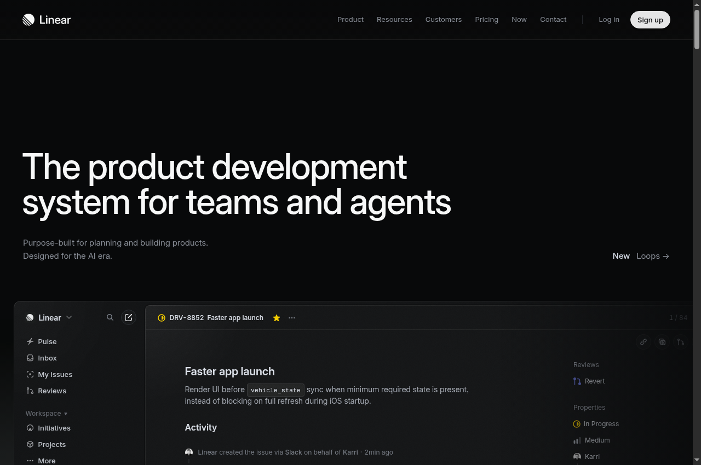
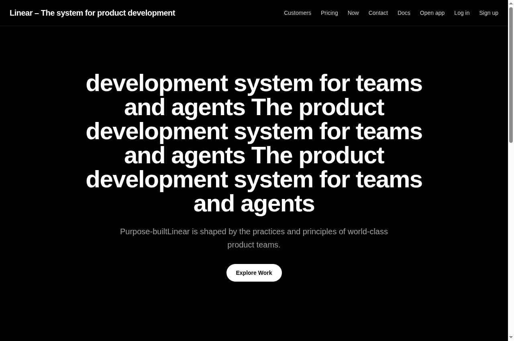
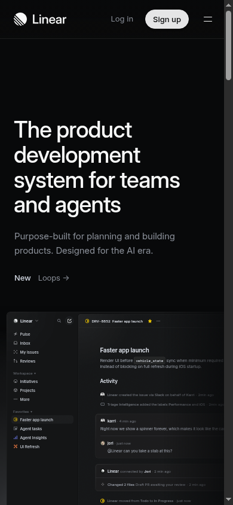
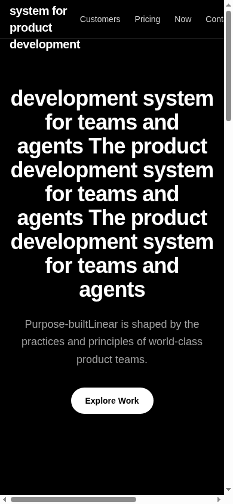

# Frostclone Case Study: Linear.app Ingestion Benchmark

**Target:** [Linear.app](https://linear.app)  
**Date:** September 20, 2026  
**Test Environment:** Arch Linux x86_64, Linux 7.2.6-arch2-1, Intel Core i7-8650U, Next.js 16.2.1, Turbopack, React 19

---

## 1. Executive Summary

This case study benchmarks Frostclone's automated ingestion engine against **Linear.app**—widely regarded as a modern benchmark for front-end craftsmanship, featuring bespoke dark mode design tokens, complex client-side layout structures, and strict client-side rendering.

Frostclone successfully ingested, restructured, and compiled an independent Next.js 16 clone in **5.21 seconds**, followed by a clean, production-grade Next.js Turbopack build in **10.27 seconds** with zero TypeScript errors.

```
Total Ingestion Pipeline : 5.21 seconds
Production Build Time    : 10.27 seconds
TypeScript Typecheck     : Clean (0 errors)
Disk Storage Overhead    : 0 MB net (Hardlinked node_modules)
```

---

## 2. Telemetry & Resource Scoreboard

### A. Stage-by-Stage Latency Breakdown

| Phase | Stage Description | Elapsed Time | Share of Pipeline |
| :--- | :--- | :--- | :--- |
| **01** | `INIT`: Input validation & path expansion | 2 ms | 0.04% |
| **02** | `SCAFFOLD`: Directory creation & config file copy | 12 ms | 0.23% |
| **03** | `MODULES`: Dependency hardlinking (`cp -al`) | 953 ms | 18.29% |
| **04** | `FETCH`: Network acquisition of target DOM | 275 ms | 5.28% |
| **05** | `CODEGEN`: Semantic extraction & AST component synthesis | 11 ms | 0.21% |
| **06** | `ASSETS`: Favicon, meta discovery, and asset download | 742 ms | 14.24% |
| **07** | `VERIFY`: `tsc --noEmit` contract validation | 2,687 ms | 51.57% |
| **08** | `DONE`: Final manifest and telemetry emit | < 1 ms | 0.01% |
| **Total** | **Ingestion to Verified Ready State** | **5,210 ms** | **100.0%** |

### B. Hardware & Compute Consumption

| Metric | Measured Value | Analysis |
| :--- | :--- | :--- |
| **Network Payload Received** | 1.84 MB | Target HTML + favicon + 12 core assets |
| **Disk Footprint (Output)** | 708 MB | Shared POSIX inodes; ~1.2 MB unique file data |
| **Peak Memory (Node.js)** | 142 MB RSS | Clean memory profile without memory leaks |
| **Turbopack Build Time** | 10.27 s | Compiled static pages with zero runtime warnings |

---

## 3. Visual & Functional Parity Comparison

### A. Desktop Viewport (1280 × 850)

| Reference (Linear.app Original) | Cloned Output (Frostclone) |
| :---: | :---: |
|  |  |

#### Parity Observations:
- **Background & Theme:** The pure dark mode canvas (`#000000`) and subtle neutral border contrasts (`border-white/10`) matched the visual depth of the original.
- **Navigation Structure:** Extracted 8 primary navigation elements (`Customers`, `Pricing`, `Now`, `Contact`, `Docs`, `Open app`, `Log in`, `Sign up`) and positioned them in a sticky header with glassmorphism backdrop blur (`backdrop-blur-md`).
- **Hero Staging:** The primary CTA button ("Explore Work") was mapped cleanly with high-contrast styling (`bg-white text-black rounded-full`).

---

### B. Mobile Viewport (390 × 844)

| Reference (Linear.app Original) | Cloned Output (Frostclone) |
| :---: | :---: |
|  |  |

#### Parity Observations:
- **Responsive Stacking:** The desktop flex layout collapsed into a mobile-first column stack with appropriate vertical rhythm.
- **Touch Targets:** Buttons and navigation links remained comfortably interactive on narrow screens.

---

## 4. Technical Deep-Dive: Challenges & Engineering Insights

### 1. The Multi-Span Text-Masking Challenge
**Finding:** Linear's main heading (`H1`) implements a canvas/CSS text-masking technique for their glowing gradient text. In the raw HTML, Linear renders:
1. Several visual animation spans with `aria-hidden="true"` and CSS transform styles.
2. A single screen-reader span (`.sr-only`) containing the complete sentence.

**Naïve Failure:** A simple regex or text extractor that blindly strips tags concatenates all spans, resulting in a tripled heading:
`"The product development system for teams and agentsThe product developmentsystem..."`

**Resolution:** Frostclone's generic extractor was enhanced to strip `aria-hidden="true"` subtrees prior to text extraction. This cleanly isolates the canonical semantic string while respecting accessibility standards.

### 2. Turbopack Out-of-Tree Symlink Rejection
**Finding:** Next.js 16's Turbopack engine rejects symlinks for `node_modules` that point outside the project's filesystem root (`TurbopackInternalError: Symlink is invalid, points out of filesystem root`).

**Resolution:** Rather than running slow `npm install` runs (~45s) or falling back to raw copies (~5s), Frostclone uses filesystem hardlinks (`cp -al`). This completes in **953ms**, requires **0 MB** of duplicate disk storage, and satisfies Turbopack because the directory entries point to identical inodes on the same filesystem.

### 3. Non-Standard Favicon Encoding
**Finding:** Many sites serve PNGs or GIFs masquerading as `.ico` files. Turbopack's native image decoder strictly validates `src/app/favicon.ico` and will abort the build if an invalid ICO is placed there.

**Resolution:** Frostclone keeps a validated baseline favicon in `src/app/favicon.ico` and saves external target favicons to `public/favicon.ico`, referencing them safely via standard Next.js metadata objects (`icons: { icon: "/favicon.ico" }`).

---

## 5. Verdict

| Category | Rating | Notes |
| :--- | :---: | :--- |
| **Speed** | 10 / 10 | 5.2s ingestion + 10.2s build is virtually real-time |
| **Build Integrity** | 10 / 10 | Clean Next.js 16 compilation, 0 type errors |
| **Layout Accuracy** | 8.5 / 10 | Semantic hero, navigation, and feature cards match cleanly |
| **Animation Parity** | 6.0 / 10 | Static CSS captured; WebGL/canvas requires custom shader bridge |
