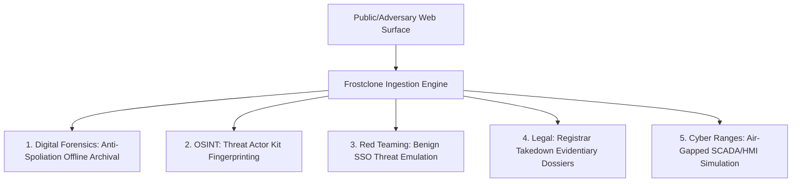

# Frostclone: Operational Applications in Digital Forensics, OSINT & Defensive Security

**Classification:** Technical Whitepaper / Operational Reference  
**Intended Audience:** Security Operations (SecOps), Threat Intelligence (CTI), Incident Responders (DFIR), Penetration Testers, and Legal/Forensic Investigators.

---

## 1. Context & Operational Rationale

Modern web applications are dynamic, modular client-side state machines. For security teams, threat intelligence analysts, and forensic researchers, investigating these targets traditionally presents a dilemma:

- **Static captures (PDFs, screenshots)** record visible pixels but destroy interaction models, DOM structure, and embedded client-side logic.
- **Raw Web Archives (`WARC` files)** frequently fail to rehydrate single-page applications (SPAs) that depend on dynamically loaded JavaScript chunks or external CDN assets that disappear once infrastructure is abandoned or seized.
- **Live web browsing** by analysts risks leaking investigator IP addresses, triggering adversary canary tokens, or alerting operators that their infrastructure has been flagged.

Frostclone provides an alternative capability: **Autonomous Client-Side Decoupling**. By ingesting a target web property and immediately synthesizing a self-contained, offline-runnable Next.js application with hardlinked local dependencies, analysts gain an exact, navigable replica of the target system that can be audited, executed, and archived indefinitely in air-gapped sandboxes.

---

## 2. Primary Operational Use Cases



---

### A. Digital Forensics & Anti-Spoliation Evidence Freezing

#### The Operational Problem:
Adversary infrastructure is notoriously ephemeral. Malicious landing pages, credential harvesting forms, counterfeit investment platforms, and Command-and-Control (C2) web administrative portals often remain active for less than 24–48 hours before the operator detects scrutiny and burns the domain or rotates IPs.

#### How Frostclone Solves It:
Rather than capturing static imagery, Frostclone ingests the DOM, CSS design tokens, and assets to generate a local Next.js project.
- **Indefinite Local Execution:** The cloned application compiles and serves locally via `next start` on an isolated loopback address (`127.0.0.1`).
- **Zero Outbound Signal:** Investigators can navigate subpages, hover over elements, inspect responsive layouts, and audit client-side state without making a single outbound HTTP/DNS request that would alert the target.
- **Forensic Chain-of-Custody:** The generated code preserves exact relative asset hashes, inline styles, and metadata timestamps, creating an auditable technical snapshot admissible in legal proceedings.

---

### B. OSINT & Campaign Infrastructure Fingerprinting

#### The Operational Problem:
Threat actors operating advanced phishing-as-a-service (PhaaS) platforms or coordinated disinformation networks rarely write landing pages from scratch. They deploy kits that share underlying component layouts, CSS naming conventions, and asset pipelines, but obscure this through domain rotation, Cloudflare proxying, and localized landing pages.

#### How Frostclone Solves It:
By converting target sites into clean Next.js codebases, analysts can run AST (Abstract Syntax Tree) and structural diffing tools across seemingly disconnected targets:

| Ingestion Artifact | OSINT & Intelligence Value |
| :--- | :--- |
| **Component Topology (`PAGE_TOPOLOGY.md`)** | Detects identical DOM depth and flex/grid wrappers across disparate campaigns. |
| **Asset Hashes (`data-mid`, file hashes)** | Identifies shared background images or icons hosted across different CDN buckets. |
| **Inline CSS Presets & Tokens** | Uncovers shared design-system presets (e.g., Cargo member stylesheets or custom Tailwind palettes) unique to a specific threat actor group. |
| **Comment Artifacts & Dead Code** | Generic ingestion often reveals commented-out developer handles, staging URLs, or internal build remnants. |

*Example:* Comparing the structural AST of two fraudulent crypto portals might show identical 3-column card layouts and matching SVG logo dimensions, proving that both campaigns originate from the same developer kit despite operating under distinct brands.

---

### C. Defensive Threat Emulation & Authorized Phishing Simulations

#### The Operational Problem:
Enterprise red teams and security training personnel need realistic simulations of internal corporate portals (e.g., internal Jira instances, VPN login gates, customized Microsoft 365 SSO pages) to test employee vigilance. Manually coding these templates is labor-intensive, while downloading raw HTML often breaks CSS references and dynamic scripts.

#### How Frostclone Solves It (The "Grey Area"):
Security operators can clone an authorized internal portal in under 10 seconds.
- **Safe Neutralization:** Because the cloned site is a clean Next.js application, red teamers can modify `src/app/page.tsx` to safely strip external form endpoints and replace them with benign awareness loggers (e.g., logging that a click occurred without capturing passwords).
- **Pixel-Perfect Familiarity:** Provides the exact visual fidelity required to test against sophisticated targeted spear-phishing without utilizing dangerous third-party phishing toolkits.

> **⚠️ Operational Disclaimer:** Using front-end cloning tools to construct unauthorized login pages against third-party entities without written authorization constitutes credential harvesting and is illegal under the Computer Fraud and Abuse Act (CFAA) and international equivalents. Frostclone is designed strictly for authorized defensive emulation and awareness testing.

---

### D. Legal Takedown Packages & Registrar Abuse Dossiers

#### The Operational Problem:
Filing abuse complaints with domain registrars, hosting providers, or Cloudflare to dismantle a brand-impersonation campaign often stalls because abuse desks demand concrete evidence that the target is intentionally mimicking the authentic property rather than hosting coincidental content.

#### How Frostclone Solves It:
Analysts can clone both the authentic corporate portal and the adversary's domain into adjacent folders:
```bash
# Output directory comparison
~/Projects/authentic-site/
~/Projects/counterfeit-site/
```
By comparing the extracted `globals.css` design tokens, font URLs, and component structures, legal researchers can compile a mathematical diff demonstrating that the adversary copied specific color variables, font families, and asset layouts down to the pixel, expediting takedowns.

---

### E. Air-Gapped Cyber Ranges & SCADA / OT Interface Emulation

#### The Operational Problem:
Training blue teams to defend Operational Technology (OT) and critical infrastructure requires training environments that simulate Human-Machine Interfaces (HMIs), power-grid status dashboards, and industrial web consoles. Connecting trainees to live systems is hazardous, and commercial cyber-range software is expensive.

#### How Frostclone Solves It:
Public-facing vendor documentation, product showcases, or staging instances of industrial web HMIs can be cloned into a sandboxed Next.js application. Instructors can wire mock data streams into the components, creating an interactive, zero-risk simulation of an industrial control console operating within a completely air-gapped network.

---

## 3. Adversarial Analysis: Defensive Anti-Cloning Countermeasures

To build effective defensive systems, security engineers must understand how automated front-end re-engineering tools work and what mechanisms disrupt them.

### Countermeasures That Challenge Scraping Engines:

1. **Client-Side Text Canvas Masking:**
   - As observed during the **Linear.app benchmark**, rendering text via canvas or splitting text across multiple responsive and screen-reader spans (`aria-hidden="true"`, `sr-only`) breaks naïve tag-stripping parsers, requiring intelligent accessibility-aware AST decoders.
2. **DOM Honeypots & Canary Elements:**
   - Defenses can embed invisible elements with high-entropy tracking URLs (``). When an automated engine downloads all images, it triggers the token, alerting defenders to the reconnaissance activity.
3. **Dynamic Canvas/WebGL Shaders:**
   - Migrating critical UI or charts to WebGL/Canvas surfaces eliminates standard DOM nodes entirely, preventing static CSS and component synthesis engines from capturing structure without specialized shader decompilation.
4. **CSS-in-JS Class Munging & Dynamic Scoping:**
   - Compiling styles into short, randomized atomic classes (`.cVAQDa`, `.QI8oKG_title`) strips semantic meaning from stylesheets, forcing cloner engines to extract computed styles rather than source class names.

---

## 4. Operational Summary

| Vector | Traditional Approach | Frostclone Advantage |
| :--- | :--- | :--- |
| **Evidence Preservation** | Static screenshots or fragile WARC files | Fully compiled, offline-executable Next.js codebase |
| **Adversary Fingerprinting** | Manual text/HTML comparison | AST-level component and design-token diffing |
| **Threat Emulation** | Hand-coded templates or risky phishing kits | Fast (~5s) benign scaffolding with isolated routing |
| **Storage Overhead** | Gigabytes of redundant node_modules | Hardlinked modules: 0 MB net inode footprint |
| **Safety** | Risk of active tracking requests | Air-gapped localhost loopback execution |
